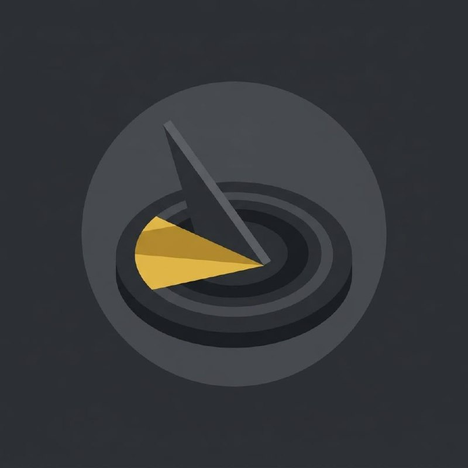

# nomon

<p align="center">
  
</p>

**노몬(nomon)** — 해시계 바늘. 태양 빛이 닿는 순간 그림자가 정답이 된다.

Rubric-first evaluation harness for OpenClaw. Define what "good" looks like before writing a single line.

---

## 노몬이 뭔가요?

**노몬(nomon)**은 해시계의 바늘이다. 태양을 기준으로 그림자를 드리워 시간을 측정하는 도구 — 인류 최초의 정량 verifier. LLM에게 묻지 않고 ground truth에 직접 대조한다.

노몬은 그 원리를 AI 하네스에 적용한다. `rubric.yaml`이 먼저, workflow가 나중이다.

| | 노몬 |
|---|---|
| 철학 | rubric-first (평가 먼저, 작성 나중) |
| 진입점 | rubric.yaml |
| 루프 | verifier → writer (PASS할 때까지) |
| 측정 방식 | 정량 / 페르소나-LLM / 사람 |
| 차단 조건 | LLM 비율 70% 초과 시 진입 불가 |

---

## Quick Start

```bash
uvx --from git+https://github.com/jkf87/nomon nomon install
```

Then in OpenClaw: `/nomon:setup`

Done. You now have `/nomon:rubric`, `/nomon:verify-check`, `/nomon:run`, `/nomon:calibrate`.

Verify: `uvx --from git+https://github.com/jkf87/nomon nomon doctor`

Uninstall: `uvx --from git+https://github.com/jkf87/nomon nomon uninstall`

---

## Workflow

```
/nomon:rubric "카드뉴스 10장 생성"
↓
rubric.yaml 정의 (정량 + 페르소나-LLM + 사람 라벨 필수)
↓
/nomon:verify-check rubric.yaml
↓ (PASS일 때만)
/nomon:run rubric.yaml
↓
writer → verifier 루프 (통과할 때까지)
↓
/nomon:calibrate rubric.yaml --samples 5
```

---

## rubric.yaml 예시

```yaml
task: "카드뉴스 10장 생성"
goal_persona:
  role: "25~35세 직장인"
  success_signal: "5초 안에 핵심 1줄 요약 가능"
items:
  - id: r1
    label: quantitative
    description: "폰트 크기 >= 24pt"
    pass_condition: "모든 텍스트 >= 24pt"
  - id: r2
    label: persona-llm
    description: "페르소나가 5초 안에 핵심 요약 가능"
    pass_condition: "PASS"
  - id: r3
    label: human
    description: "이미지-내용 톤 일치"
    pass_condition: "검토자 승인"
taste_gate:
  spearman_threshold: 0.7
```

Rules enforced:
- `quantitative` 항목 최소 30% 필수 (미달 시 진입 차단)
- `persona-llm` 70% 초과 시 차단
- `taste_gate`: 사람 채점 vs LLM 채점 상관계수 0.7 미만이면 rubric 리파인 강제

---

## Building this Repo

Run tests: `pytest tests/ -v`

Auto-test: `bash verification/auto/run_install_test.sh`

---

## License

MIT — See `LICENSE` file.
